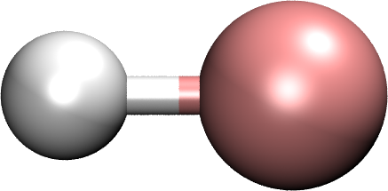

.. _zcasscf:

********************************************************************
Relativistic complete active space self-consistent field (RelCASSCF)
********************************************************************

Description
===========
Full CI diagonalizes Full CI Hamiltonian.

.. math::
  H\Psi = E\Psi

Pre-requisite
=============
Reference wave function (such as HF).

Command: ``zcasscf``

Keywords
========
.. topic:: ``algorithm``

   | **Description**:  CASSCF optimization algorithm
   | **Options**:  "second":  second-order optimization algorithm;  "noopt" - no orbital optimization performed; program exits after one CAS-CI calculation using the given input orbitals.  Obsolete versions of BAGEL might also include SuperCI and BFGS algorithms, but the second-order algorithm has shown better convergence.   
   | **Default**: "second"
   | **Datatype**: string
   | **Recommendation**:  Use default

.. topic:: ``gaunt``

   | **Description**:  Used to specify the form of the 2-electron Hamiltonian used.  The default is to use the Dirac--Coulomb Hamiltonian;
   |     If "gaunt" is set to true, the Gaunt interaction will be added, which accounts for direct spin--spin and spin-other-orbit 
   |     coupling between electrons.  
   | **Default**: Value obtained from reference wavefunction.  
   | **Datatype**: bool
   | **Recommendation**:  Choose based on the importance of relativistic effects for your problem.  

.. topic:: ``breit``

   | **Description**:  Used to determine whether the full Breit interaction (including the gauge term) is included in the two-electron Hamiltonian.  
   | **Default**: Value obtained from reference wavefunction.  
   | **Datatype**: bool
   | **Recommendation**:  Choose based on the importance of relativistic effects for your problem.  

.. topic:: ``nact``

   | **Description**: Number of active orbitals
   | **Default**: 0
   | **Datatype**: int

.. topic:: ``natocc``

   | **Description**: If set to "true," occupation numbers of natural orbitals within the active space will be printed to casscf.log after each macroiteration.
   | **Default**: false
   | **Datatype**: bool
   | **Recommendation**:  Use default

.. topic:: ``nclosed``

   | **Description**:  Number of closed orbitals
   | **Default**: Full core space (1 orbital for He - F atom; 5 for each Ne - Cl atom, etc.)
   | **Datatype**: int

.. topic:: ``charge``

   | **Description**:  Molecular charge.  
   | **Default**: 0
   | **Datatype**: int

.. topic:: ``hcore_guess``

   | **Description**:  If set to true, the one-electron Hamiltonian is diagonalized to generate initial guess orbitals.  
   | **Default**: false
   | **Datatype**: bool
   | **Recommendation**:  Use default.  The guess orbitals obtained from this option are usually inferior to those from DHF or a CASSCF calculation with a smaller active space.   

.. topic:: ``maxiter``

   | **Description**:  Maximum number of macroiterations, after which the program will terminate if convergence is not reached.  
   | **Default**: 100
   | **Datatype**: int
   | **Recommendation**:  The default is usually more than enough, if it is going to converge.  
   |      Note that if DHF is automatically called to generate guess orbitals, "maxiter_scf" can be used to set a different maximum for that step.  

.. topic:: ``maxiter_micro``

   | **Description**:  Maximum number of microiterations, after which the program will terminate if convergence is not reached.  
   | **Default**: 20
   | **Datatype**: int
   | **Recommendation**:  This parameter must sometimes be increased for difficult optimizations.  

.. topic:: ``maxiter_fci``

   | **Description**: Maximum number of iterations in CI coefficient optimization for the CAS-CI part
   | **Default**: copied from "maxiter"
   | **Datatype**: integer
   | **Recommendation**:  It is recommended to set this to a fairly high value.  If the CAS-CI part does not fully converge, the 
   |     CASSCF algorithm will continue using the approximate solution, but you should make sure it is fully converged in the final macroiteration.  

.. topic:: ``thresh``

   | **Description**:  Convergence threshold for the root-mean-squared of the error vector.  
   | **Default**: 1.0e-8
   | **Datatype**: double
   | **Recommendation**:  1.0e-8 is a fairly tight threshold; 1.0e-7 or 1.0e-6 might be appropriate for some problems.  
   |      Note that if DHF is automatically called to generate guess orbitals, "thresh_scf" can be used to set a different convergence threshold for that step.  

.. topic:: ``thresh_micro``

   | **Description**:  Microiteration convergence threshold
   | **Default**:  One-half the value set for "thresh"
   | **Datatype**: double
   | **Recommendation**:  Use the default value.

.. topic:: ``thresh_fci``

   | **Description**:  Convergence threshold for the CI coefficients during the CAS-CI step
   | **Default**:  Value copied from "thresh"
   | **Datatype**: double
   | **Recommendation**:  A low convergence threshold here sometimes causes a loss of time-reversal symmetry; we recommend setting it a couple orders of magnitude smaller than the "thresh" value.  

.. topic:: ``active``

   | **Description**:  Orbital indices for the spatial MOs that should be included in the active space.  
   | **Default**:  Frontier orbitals are used.  If a DHF reference waveunction (or Hcore guess) is used, the canonical orbitals are ordered by orbital energy, 
   |     the "nclosed" lowest-energy orbitals are set to closed, and the next "nact" are set to active.  If the reference wavefunction was 
   |     generated by CASSCF, the order of orbitals is maintained.  
   | **Datatype**: vector of integers
   | **Recommendation**:  The convergence behavior is often improved by choosing guess orbitals similar in character to your target active orbitals.  
   |     For both relativistic Hartree--Fock and CASSCF, useful tools to identify good starting orbitals include using the "pop" keyword to print 
   |     orbital population analysis and using the "moprint" module to visualize orbital densities using Gaussian cube format.  

.. topic:: ``only_electrons``

   | **Description**:  This option allows the user to freeze all positronic orbitals and optimize only for rotations between electronic orbitals.  
   | **Default**:   false
   | **Datatype**: bool
   | **Recommendation**:  Use default 

.. topic:: ``pop``

   | **Description**:  If set to true, population analysis of the molecular orbitals will be printed to a file names dhf.log.  
   | **Default**: false
   | **Datatype**: bool
   | **Recommendation**:  It is recommended to verify that your converged orbitals are what you expect, and this is one tool for doing that.  

.. topic:: ``aniso``

   | **Description**:  This is the key for a block in the input file which provides parameters for magnetic anisotropy analysis, in determination of *g*-factors and zero-field splitting parameters.  See below for details.  

.. topic:: ``davidson_subspace``

   | **Description**:  Number of vectors retained in the limited-memory algorithm for the CAS-CI part
   | **Default**: 20
   | **Datatype**: integer
   | **Recommendation**: Altering this parameter can sometimes change the convergence behavior.  Any number above 3 is reasonable.  

.. topic:: ``print_thresh``

   | **Description**:  Threshold below which CI coefficients are not printed (to casscf.log after each macroiteration, and to the standard output at the end of the calculation)
   | **Default**: 0.05
   | **Datatype**: double

.. topic:: ``state``

   | **Description**: Number of states computed for each spin value.  All are included in the state-averaging procedure when orbitals are optimized.   
   | **Default**:  There is no default; this parameter must be supplied in the input.  
   | **Datatype**: vector of integers
   | **Note**:  An array of integers is supplied, where each one indicates the number of states for a given spin value.  For example, 
   |      the input [ 1 ] gives a singlet ground state, while [ 3, 0, 1 ] gives three singlets and one triplet (6 states total).  
   |      Be careful!  While the spin values you specified are used in generating guess CI coefficients, the spin sectors will mix, and the 
   |      algorithm returns the *n* lowest eigenstates regardless of their spin expectation values.  

.. topic:: ``spin_adapt``

   | **Description**:  This parameter allows us to deactivate the generation of spin-adapted configuration state functions in the starting guess for the CAS-CI part.  
   | **Default**: true
   | **Datatype**: boolean
   | **Recommendation**:  Normally use the default setting.  If you are computing all or nearly all the states that can be formed with a given 
   |     active space, you will encounter an error stating that "generate_guess produced an invalid determinant."  
   |     Deactivating this feature leads to a poorer guess but eliminates that problem.  

.. topic:: ``robust``

   | **Description**:  If DHF is automatically called to generate starting orbitals, this parameter determines whether or not to use the "robust fitting" algorithm for the integrals in that part.  For the main CASSCF calculation, robust fitting is always used with the full Breit interaction and not with the Dirac--Coulomb or Dirac--Coulomb--Gaunt Hamiltonians.   
   | **Default**: false
   | **Datatype**: bool
   | **Recommendation**: use default.

.. topic:: ``diis_start``

   | **Description**:  If DHF is automatically called to generate starting orbitals, then during that part we will begin using Pulay's Direct Inversion in the Iterative Subspace (DIIS) algorithm to update the orbitals after the specified iteration.   
   | **Default**: 1
   | **Datatype**: int
   | **Recommendation**: use default.

.. topic:: ``thresh_overlap``

   | **Description**:  If DHF is automatically called to generate starting orbitals, this is used to identify linear dependancy in the atomic basis set.  Increasing this value will more aggressively remove linearly dependent basis vectors.  If starting orbitals are provided by a previous calculation, the same set of truncated orbitals is used, and this parameter is ignored.  
   | **Default**: 1.0e-8
   | **Datatype**: double
   | **Recommendation**: use default.

Example
=======
This should be an example that is chemically relevant. There should be text explaining what the example is and why it's interesting.

Sample input
------------

.. code-block:: javascript 

   { "bagel" : [

   {
     "title" : "molecule",
     "basis" : "sto-3g",
     "df_basis" : "svp-jkfit",
     "angstrom" : false,
     "geometry" : [
       { "atom" : "F",  "xyz" : [   -0.000000,     -0.000000,      2.720616]},
       { "atom" : "H",  "xyz" : [   -0.000000,     -0.000000,      0.305956]}
     ]
   },

   {
     "title" : "hf",
     "thresh" : 1.0e-10
   },

   {
     "title" : "fci",
     "algorithm" : "parallel",
     "nstate" : 2
   }

   ]}

Some information about the output should also be included. This will not be entire output but enough for the reader to know their calculation worked.

    This is an example of how to insert a figure. 

References
==========

+-----------------------------------------------+-----------------------------------------------------------------------+
|          Description of Reference             |                          Reference                                    | 
+===============================================+=======================================================================+
| Reference was used for...                     | John Doe and Jane Doe. J. Chem. Phys. 1980, 5, 120-124.               |
+-----------------------------------------------+-----------------------------------------------------------------------+
| Reference was used for...                     | John Doe and Jane Doe. J. Chem. Phys. 1980, 5, 120-124.               |
+-----------------------------------------------+-----------------------------------------------------------------------+

